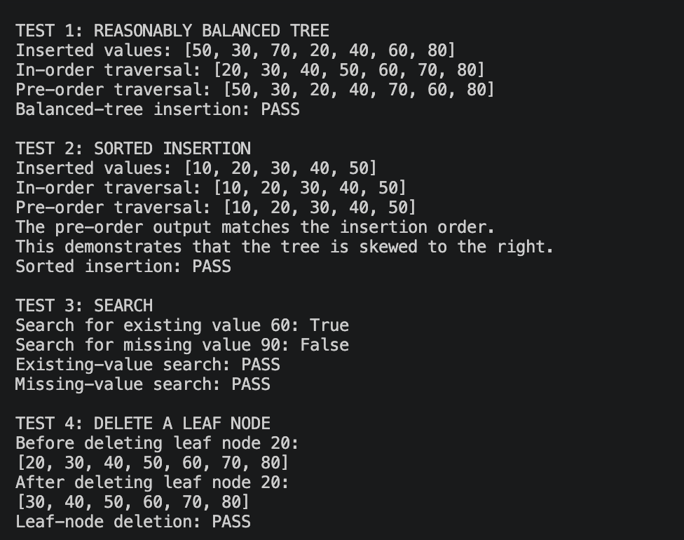
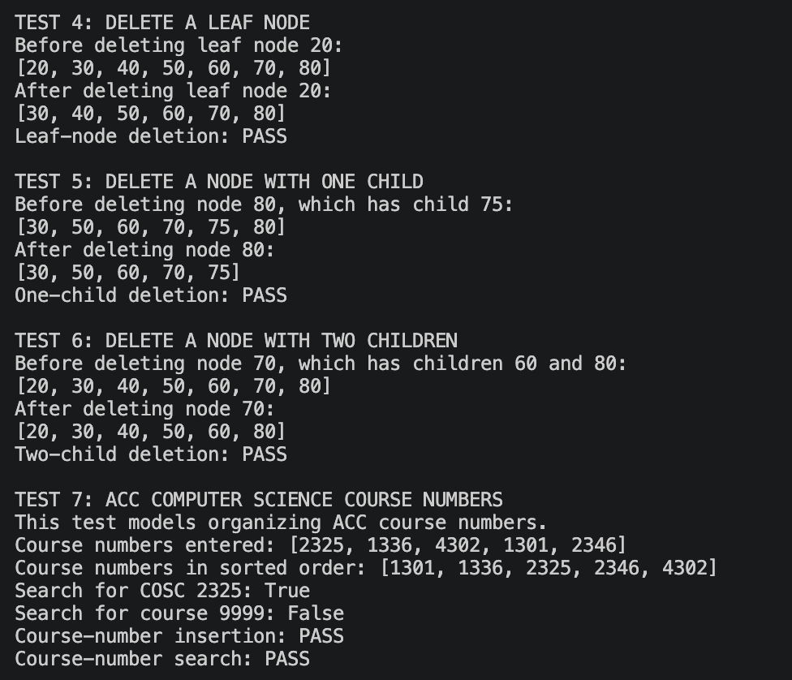

# Programming Assignment 4: Binary Search Tree

**Name:** Erica Cepeda  
**Course:** CS 5329

## Description
In this project, a binary search tree is implemented in Python. The program supports insertion, search, deletion, in-order traversal, and pre-order traversal. It includes tests for a reasonably balanced tree, a skewed tree created through sorted insertion, successful and unsuccessful searches, and the deletion of nodes with zero, one, and two children. An additional test uses ACC computer science course numbers to demonstrate a practical use of the data structure.

## How to Run
Ensure that Python 3 is installed. Download or clone the repository, open a terminal in the repository folder, and run:

```bash
python3 binary_search_tree.py
```

The following command may also be used on systems where Python is accessed through `python`:

```bash
python binary_search_tree.py
```

## Files
- `binary_search_tree.py`: Binary search tree implementation and test cases
- `report.md`: Written analysis, AVL rotation discussion, test results, and reflection
- `01_bst_tests.png`: Execution evidence for Tests 1-4
- `02_bst_tests.png`: Execution evidence for Tests 5-7

## Test Cases
For testing, the program makes use of a relatively balanced sequence of values `[50, 30, 70, 20, 40, 60, 80]` and a sorted set of values `[10, 20, 30, 40, 50]` which form a skewed tree. This program performs search operations on both available and unavailable values, shows deletion of nodes having zero, one, and two children. An inorder traversal of the tree shows that the values are always sorted, whereas pre-order traversal shows the structure of the tree. The last test arranges and searches ACC computer science courses.

## Execution Evidence



